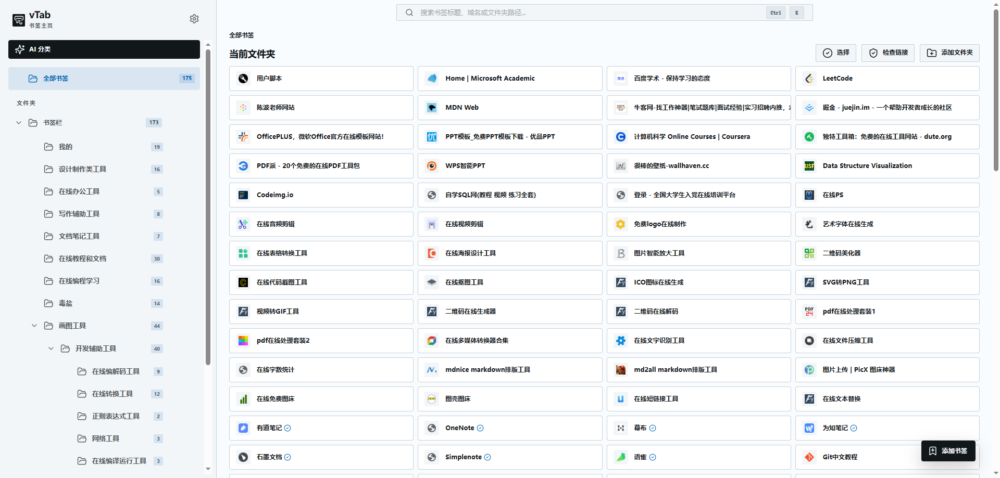

# WeTab

WeTab is a **Chromium browser extension** that replaces the default new-tab page with a dense, professional workspace for navigating, organizing, and maintaining your browser bookmarks.



---

## Features

### 📑 Native Bookmark Management
- Full read/write access to Chrome bookmarks — folders, subfolders, and individual links render as an interactive sidebar and card grid.
- **Create**, **edit**, **delete**, and **move** bookmarks and folders directly from the new-tab page.
- **Drag and drop** to reorganize — nest bookmarks into folders, reorder items, restructure your tree.
- **Folder sidebar** with collapsible nesting, resize handles, and a "show all" fast-switch.

### 🔍 Powerful Search
- Search across bookmark **titles**, **URLs/domains**, and **folder paths** in real time.
- Breadcrumb navigation shows your current location in the folder tree.
- Keyboard shortcut (`Ctrl/Cmd + A`) for selecting all visible items.

### 🎯 Bulk Selection & Operations
- **Marquee selection** — click and drag to sweep-select bookmarks or folders.
- **Shift-click** for range selection, **Ctrl/Cmd-click** for additive selection.
- **Bulk move**, **copy**, and **delete** with undo support.
- Context menus on right-click for quick actions.

### 🔗 Link Health Validation
- Validate bookmark URLs are still reachable — with **verified** / **offline** / **unchecked** status badges.
- **Scheduled validation** runs automatically in the background (configurable interval: 15 min to 24 h, per-folder or all).
- Manual "check visible links" button for on-demand validation.

### 🤖 LLM-Powered Organization (Opt-in)
- Connect any **OpenAI-compatible** API provider (local LLM via Ollama/LM Studio, OpenAI, etc.).
- Request **AI classification suggestions** to automatically organize bookmarks into folders.
- All suggestions are **reviewable** before any bookmark changes are applied — nothing happens to your bookmarks without explicit approval.
- Apply, reject, or bulk-accept suggestions with one click.
- **Zero data sent** until you explicitly trigger a suggestion request.

### 🎨 Digital Air Design System
- **Token-first** CSS architecture with OKLCH color spaces for accurate light/dark rendering.
- **Light**, **Dark**, and **System** theme modes (follows OS preference).
- Dense, high-information layouts with precise typography scale.
- "Glass panel" aesthetics, focus rings, and micro-interactions.
- Responsive down to 620px — mobile-aware sidebar, adaptive grid.

### 🌐 Internationalization
- **English** (en) and **Chinese** (zh-CN) built-in.
- Auto-detects browser UI language; user preference persisted and instantly applied.

---

## For Users

### Download

Pre-built WeTab packages are available on the **[GitHub Releases](https://github.com/weilong/vtab/releases)** page.

Each release includes a `.zip` file (`wetab-<version>.zip`) containing the fully built extension, ready for sideloading into your browser.

> ⚠️ WeTab is currently available for **sideloading** (via Chrome's developer mode). Chrome Web Store publishing is planned for a future release.

### Install in Browser

1. Download the latest `wetab-<version>.zip` from the [Releases](https://github.com/weilong/vtab/releases) page.
2. Unzip the file to a folder on your computer.
3. Open Chrome / Edge / Brave and navigate to `chrome://extensions`.
4. Enable **Developer mode** (toggle in the top-right corner).
5. Click **Load unpacked** and select the unzipped folder.
6. Open a new tab — you should see WeTab as your homepage.

> 💡 **Pro tip:** You can also drag the `.zip` file directly onto the `chrome://extensions` page (with Developer mode on) — Chrome will extract and load it automatically.

### Usage Guide

Once WeTab is installed, every new tab shows your bookmark workspace:

| What to do | How |
|---|---|
| **Browse folders** | Click a folder in the left sidebar. The bookmark grid updates to show only items in that folder. |
| **Search bookmarks** | Type in the top search bar — results filter by title, URL, and folder path in real time. |
| **Open a bookmark** | Click any bookmark card to open the link in the current tab. |
| **Open in new tab** | Middle-click or Ctrl/Cmd-click a bookmark card. |
| **Create a bookmark** | Click the **+** floating action button (bottom-right). Fill in the title and URL, then save. |
| **Create a folder** | Right-click anywhere in the sidebar → pick a target parent → save. |
| **Edit a bookmark/folder** | Hover over a card → click the ✏️ icon that appears, or right-click and choose **Edit**. |
| **Delete** | Hover over a card → click the 🗑️ icon, or right-click → **Delete**. Confirm in the dialog. |
| **Move items** | Drag a bookmark onto a sidebar folder, or use right-click → **Move to** → pick a destination. |
| **Multi-select** | Click and drag across cards to marquee-select, or hold Shift/Ctrl and click individual items. Bulk actions appear at the bottom. |
| **Check link health** | Click the **shield icon** in the top toolbar to validate visible links. |
| **Change theme** | Use the theme picker at the bottom of the sidebar (Light / Dark / System). |
| **Open Settings** | Click the ⚙️ gear icon in the sidebar, or right-click the extension icon → **Options**. |
| **LLM suggestions** | First configure an LLM provider in Settings. Then select bookmarks (or leave all visible) and click **Suggest** in the sidebar. Review suggestions before applying. |
| **Undo** | After a delete or move, a toast notification appears at the top-right with an **Undo** button. |

---

## For Developers


### Tech Stack

| Layer | Technology |
|---|---|
| Framework | [WXT](https://wxt.dev/) + React 19 |
| Language | TypeScript 5.7 |
| Build | Vite 6 |
| Styling | CSS Custom Properties + OKLCH tokens |
| Icons | Lucide React |
| Testing | Vitest (unit) + Playwright (E2E) |
| Linting | ESLint 10 |

### Prerequisites

- **Node.js** 22+
- **npm** 10+
- A **Chromium-based browser** (Chrome, Edge, Brave, etc.)

### Setup

```bash
# Clone the repository
git clone <repo-url>
cd vtab

# Install dependencies
npm install
```

### Development Server (Hot Reload)

```bash
npm run dev
```

This launches the WXT dev server. It automatically opens a Chromium window with WeTab loaded as an unpacked extension. **Changes to source files hot-reload the extension in real time** — no manual refresh needed.

The dev server outputs to `.output/chrome-mv3-dev/`.

### Production Build

```bash
npm run build
```

Creates an optimized production build in `.output/chrome-mv3/`. Run this when you're ready to test a production-like build or package for distribution.

### Load Unpacked (Development Build)

If the dev server didn't auto-load, or you want to load a specific build manually:

1. Open `chrome://extensions`.
2. Enable **Developer mode** (top-right).
3. Click **Load unpacked**.
4. Select `.output/chrome-mv3-dev/` (dev) or `.output/chrome-mv3/` (production).

### Package for Distribution

```bash
npm run zip
```

Generates a `.zip` file in `.output/` ready for sideloading or Chrome Web Store upload.

### Testing

```bash
# Run unit tests (Vitest)
npm run test

# Run end-to-end tests (Playwright)
npm run test:e2e
```

### Code Quality

```bash
# Lint (zero-warnings policy)
npm run lint

# TypeScript type-check
npm run typecheck
```

### Clean Generated Files

```bash
npm run clean
```

Removes `.output/` and other generated directories.

---

## Scripts Reference

| Command | Description |
|---|---|
| `npm run dev` | Start WXT dev server with hot-reload |
| `npm run build` | Clean + production build |
| `npm run zip` | Package extension into a `.zip` file |
| `npm run test` | Run unit tests (Vitest) |
| `npm run test:e2e` | Run Playwright end-to-end tests |
| `npm run lint` | ESLint check (zero-warnings policy) |
| `npm run typecheck` | TypeScript type-check |
| `npm run clean` | Remove generated output directories |

---

## Project Structure

```
entrypoints/
├── newtab/            # Browser new-tab page replacement
├── options/           # Extension settings (LLM config, theme, language)
└── design-system/     # Development-only design token preview

src/
├── components/        # Reusable UI primitives (AppShell, Sidebar,
│                      #   BookmarkCard, TopSearch, Button, etc.)
├── pages/             # Thin page assemblies (NewTabPage, OptionsPage,
│                      #   DesignSystemPage)
├── services/          # Browser API integration & business logic
│   ├── bookmarkService.ts          # Chrome bookmarks CRUD
│   ├── llmConfigService.ts         # LLM provider settings
│   ├── llmSuggestionService.ts     # AI classification suggestions
│   ├── urlValidationService.ts     # Link health checks
│   ├── themePreferenceService.ts   # Theme persistence
│   └── languageService.ts          # i18n persistence
├── hooks/             # React hooks (useI18n, useThemePreference, etc.)
├── styles/
│   ├── tokens.css     # Design tokens (colors, type, spacing, etc.)
│   └── global.css     # Shared component & layout styles
├── types/             # TypeScript view-model types
├── data/              # Sample data for development previews
├── i18n/              # Internationalization messages (en, zh-CN)
└── testing/           # Test setup & browser mocks

tests/
└── e2e/               # Playwright end-to-end tests
```

---

## Configuration

### LLM Provider

Navigate to **Options** (right-click extension icon → Options, or visit `chrome-extension://<id>/options.html`) to configure:

| Field | Description |
|---|---|
| **Base URL** | OpenAI-compatible API endpoint (e.g., `https://api.openai.com/v1` or `http://localhost:11434/v1` for Ollama) |
| **API Key** | Your API key |
| **Model** | Model identifier (e.g., `gpt-4o-mini`, `llama3.2`) |

Use **Test connection** to verify without touching your bookmarks. No bookmark data is transmitted until you explicitly request suggestions.

### Theme

Toggle **Light**, **Dark**, or **System** (follow OS) in the sidebar theme picker. Theme preference persists across sessions.

### Language

Choose **English** or **中文** in Options. The extension auto-detects your browser's UI language on first visit.

### Link Validation Scheduling

In Options, enable scheduled link checks to automatically re-verify bookmark URLs at your chosen interval (15 min / 1 h / 6 h / 24 h). Optionally restrict to a specific folder.

---

## Permissions

WeTab requires these Chrome permissions:

| Permission | Reason |
|---|---|
| `bookmarks` | Read and write your native browser bookmarks |
| `favicon` | Display website favicons on bookmark cards |
| `storage` | Persist settings (theme, language, LLM config, validation statuses) |
| `http://*/*` / `https://*/*` | Validate bookmark URLs are still reachable |

Data stays local by default. LLM provider data is only sent when you **explicitly request** suggestions.

---

## Architecture Highlights

### Design System — Token-First

Colors, typography, spacing, radius, and shadows are defined as CSS custom properties in `tokens.css`. OKLCH color functions ensure perceptually-uniform light and dark palettes. The theme system (`light` / `dark` / `system`) switches the entire token set via `data-theme` attributes.

### Component Reuse

Pages compose existing components rather than defining new visual systems. Components accept focused props and `className` for variant composition. The Design System Preview validates every token and component in isolation.

### Service Layer

Browser APIs (`chrome.bookmarks`, `chrome.storage`) are isolated behind service modules (`src/services/`). React components never call browser APIs directly — improving testability and keeping the presentation layer platform-agnostic.

## License

MIT
